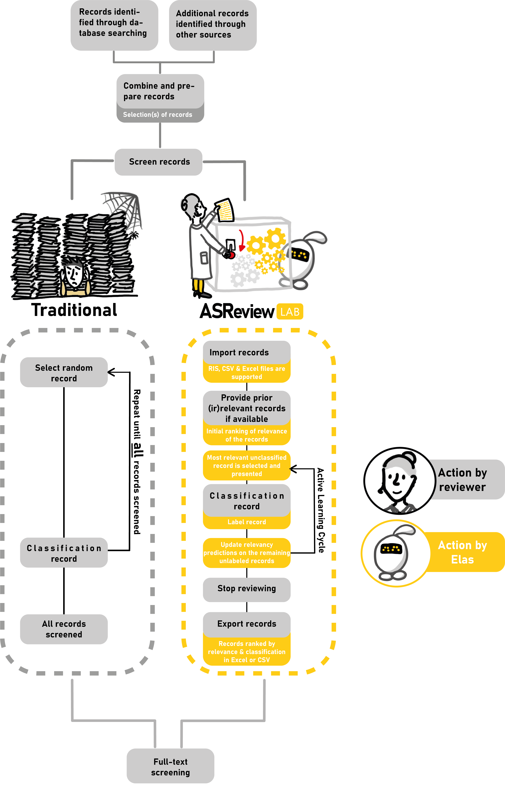
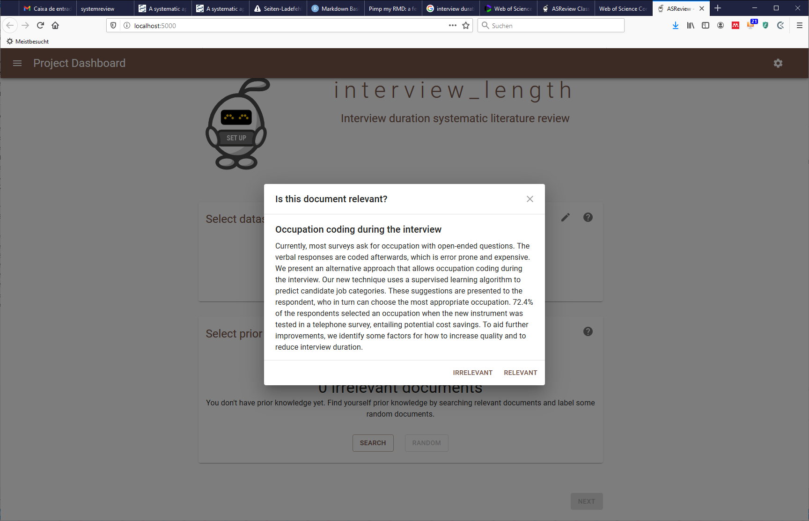
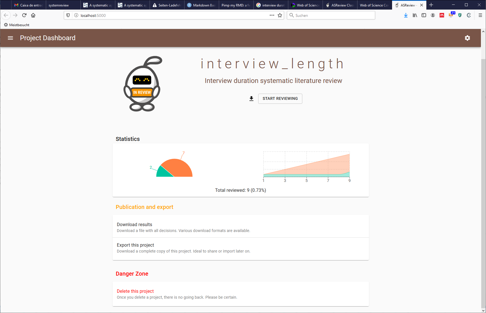

```{r setup, include=FALSE}
knitr::opts_chunk$set(echo = TRUE)
```


# Introduction

The main goal of this document is to introduce systematic reviews, explain why they are useful and present a workflow to conduct a systematic review with the help of an active learning system.

# What is a systematic review?

Systematic literature reviews are a method of making sense of large bodies of information, and a means of contributing to the answers to questions about what works and what does not – and many other types of question too. They are a method of mapping out areas of uncertainty, and identifying where little or no relevant research has been done, but where new studies are needed. 

Systematic reviews also flag up areas where spurious certainty abounds. These are areas where we think we know more than we do, but where in reality there is little convincing evidence to support our beliefs. [(Petticew & Roberts, 2005, pp. 2](https://doi.org/10.1002/9780470754887))


## Systematic review vs meta-analysis vs Narrative review

A systematic review answers strives to comprehensively identify, appraise, and synthesize all the relevant studies on a given topic. Systematic reviews are often used to test just a single hypothesis, or a series of related hypotheses.

A meta-analysis uses a specific statistical technique for synthesizing the results of several studies into a single quantitative estimate (i.e., a summary effect size).

A narrative review is the process of synthesizing primary studies and exploring heterogeneity descriptively, rather than statistically. [(Petticew & Roberts, 2005, pp. 19](https://doi.org/10.1002/9780470754887))


## Why do a systematic review?

It is a fair criticism of scientific research that it is often difficult to know which, if any, study to believe.

> Newton’s Third Law of Motion: ‘‘For every expert there is an equal and opposite expert.’’

The traditional scientific approach to this problem is to carry out a literature review.

However, traditional literature reviews frequently summarize highly unrepresentative samples of studies in an unsystematic and uncritical fashion.

But the problem is not just one of inconsistency, but one of information overload.

The massive expansion of research output, both in peer-reviewed publications, and unpublished, e.g. in conference presentations or symposia, mean it is difficult to establish what work has been done in your area already, and to ensure that knowledge keeps up to date with the best research evidence. 

## The role of systematic literature reviews

Systematic reviews are literature reviews that adhere closely to a set of scientific methods that explicitly aim to limit systematic error (bias), mainly by attempting to identify, appraise and synthesize all relevant studies (of whatever design) in order to answer a particular question (or set of questions).


Systematic review will be most useful when:

• there is a clear and defined research question

• several empirical studies have been published

• there is uncertainty about the results


***


# Tutorial: My first systematic review with active learning

A systematic review needs a detailed protocol that describes how the review will be processed and methods that will be applied. There are several published examples of such protocols. Here we follow the protocol suggested by [Bramer et al. (2018)](https://www.ncbi.nlm.nih.gov/pmc/articles/PMC6148622/) which consists on the following steps:

1. Determine a clear and focused question

2. Describe the articles that can answer the question

3. Decide which key concepts address the different elements of the question

4. Decide which elements should be used for the best results

5. Choose an appropriate database and interface to start with

6. Document the search process in a text document

7. Identify appropriate index terms in the thesaurus of the first database

8. Identify synonyms in the thesaurus

9. Add variations in search terms

10. Use database-appropriate syntax, with parentheses, Boolean operators, and field codes

11. Optimize the search

12. Evaluate the initial results

13. Check for errors

14. Translate to other databases

15. Test and reiterate


Note: This tutorial will not follow through with an exhaustive account of each of these steps. Instead, a shortened version of this list will presented and discussed. 

## Determine a clear and focused question 

For the sake of this exercise, the aim is to answer the following question: 

>What factors explain interview duration in computer assisted telephone surveys?

## Describe the articles that can answer the question


Research articles that collect and analize interview duration with computer assisted telephone surveys (CATI) data.

## What are the research question key concepts?

- Survey

- telephone

- Interview duration

## Choose the database

There is a very long list of [academic databases and search engines](https://en.wikipedia.org/wiki/List_of_academic_databases_and_search_engines).

>How to choose? 

In addition to any specific requirements which might come from the specificity of the research question (e.g. medical trials have dedicated databases), recent research by [Gusenbauer and Haddaway (2019](https://onlinelibrary.wiley.com/doi/full/10.1002/jrsm.1378)) suggests the following databases:  

* [ACM Digital Library](https://dl.acm.org/) 
* [BASE](https://www.base-search.net/) 
* [ClinicalTrials.gov](https://www.clinicaltrials.gov/) 
* [Cochrane Library](https://www.cochranelibrary.com/) 
* [EbscoHost](https://www.ebsco.com/products/research-databases) (tested for ERIC, Medline, EconLit, CINHAL Plus, SportsDiscus)
* [OVID](https://www.ovid.com/) (tested for Embase, Embase Classic, PsychINFO) 
* [ProQuest](https://www.proquest.com/index) (tested for Nursing & Allied Health Database, Public Health Database)
* [PubMed](https://pubmed.ncbi.nlm.nih.gov/) 
* [ScienceDirect](https://www.sciencedirect.com/) 
* [Scopus](https://scopus.com/) 
* [TRID](https://trid.trb.org/) 
* [Virtual Health Library](https://www.who.int/chp/knowledge/vhl/en/) 
* [Web of Science](https://webofknowledge.com/WOS) (tested for Web of Science Core Collection, Medline) 
* [Wiley Online Library](https://onlinelibrary.wiley.com/)


**[Gusenbauer and Haddaway (2019](https://onlinelibrary.wiley.com/doi/full/10.1002/jrsm.1378)) further suggest that systems such as Google scholar have severe performance limitations and should only be considered supplementary to these latter databases, especially for non-query‐based search methods where they might still provide great benefit.**

***

For the sake of this exercise, we go with the [Web of Science Core Collection](https://www.webofknowledge.com)

## Document the search process

Keep a log of the all the steps taken to make the search reproducible.

## Identify appropriate index terms and identify synonyms

The initial terms we identify are the following:

* duration
* telephone
* Survey

## Add variations in search terms (truncation, spelling differences, abbreviations, opposites)

* timestamps
* interview lenght
* CATI

## Use database appropriate syntax

Check the [advance search](http://images.webofknowledge.com/WOKRS535R100/help/WOS/hp_advanced_search.html) help menu of Web of Science.

The start of our query will be the following:

>ALL=(survey  AND  telephone  AND  duration)  

{width=120%}


## Optimize the search

>We can start delimiting and optimizing our search by, for example, selecting the language and the type of documents.

{width=120%}


Next we can add the synonyms we previously identified.

>ALL=(survey OR surveys)  AND  ALL=(telephone  OR  CATI)  AND  ALL=(duration  OR  length  OR  timestamps)

{width=120%}


## Extend this query to other databases

Extend this query to other databases fitting your research question.

***

# Selecting the relevant literature: presenting the ASReview  

So now we got the data and we have 1227 entries. Do we have to read all this papers?

>Short answer: yes. 

However, it is very likely that a high proportion of these entries are actually not relevant to our research question. We can then look for the help of more systematized methods to reduce the number of papers we actually have to read.

## ASReview

[ASReview](https://asreview.nl/) enables you to screen more texts than the traditional way of screening in the same amount of time. Which means that you can achieve a higher quality than when you would have used the traditional approach.


{width=70%}


The following video presents how ASReview helps us gain in efficiency compared to traditional reviews.


Source: [Here](https://twitter.com/LGTummers/status/1326153384710168576)

Detailed information regarding how to install and other relevant issues can be found in the [ASReview](https://asreview.nl/) website. 


## Example: using the ASreview

>After compiling the results of the systematic review to a .ris format file we can introduce it to ASReview.


{width=80%}


>Then we must set the priors to train the active learning system. This is done by looking at the abstracts and selecting the ones that are relevant or irrelevant to our research question.

{width=80%}


{width=80%}

>After classifying some documents (the more, the better)  we can select the model of our preference. More information about the specificities of each of these training models can be found in the [ASReview](https://asreview.nl/) website.

{width=80%}


{width=80%}


## Final Results

>In the final results we can see all the 1227 entries of the literature review now ranked by relevance following the priors we set in the active learning model. 


```{r, echo=FALSE, warning=FALSE}


library(readxl)
library(knitr)
library(kableExtra)


df <- read_excel("asreview_result_interview-length.xlsx")


```


>A closer look to each of the final results columns.

```{r, echo=FALSE, warning=FALSE}


#kable(df[1:2, ], format = "html") 

x<-kable(df[1:2, ], format = "html") 
column_spec(x,10,width_min = "40em")

#kable(df[1:2, ])


```


# Further information

How to report systematic review and metanalyses?

[PRISMA](https://www.prisma-statement.org/) 


