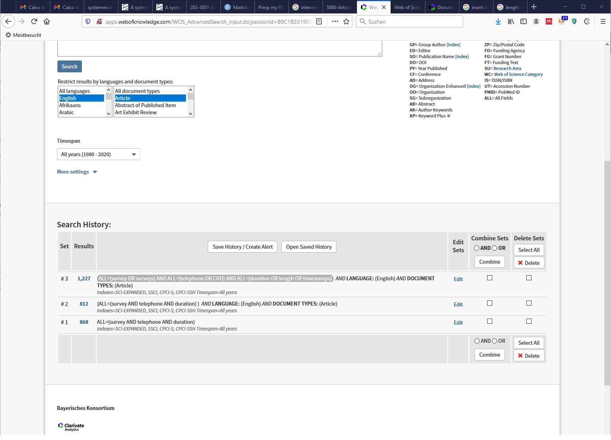
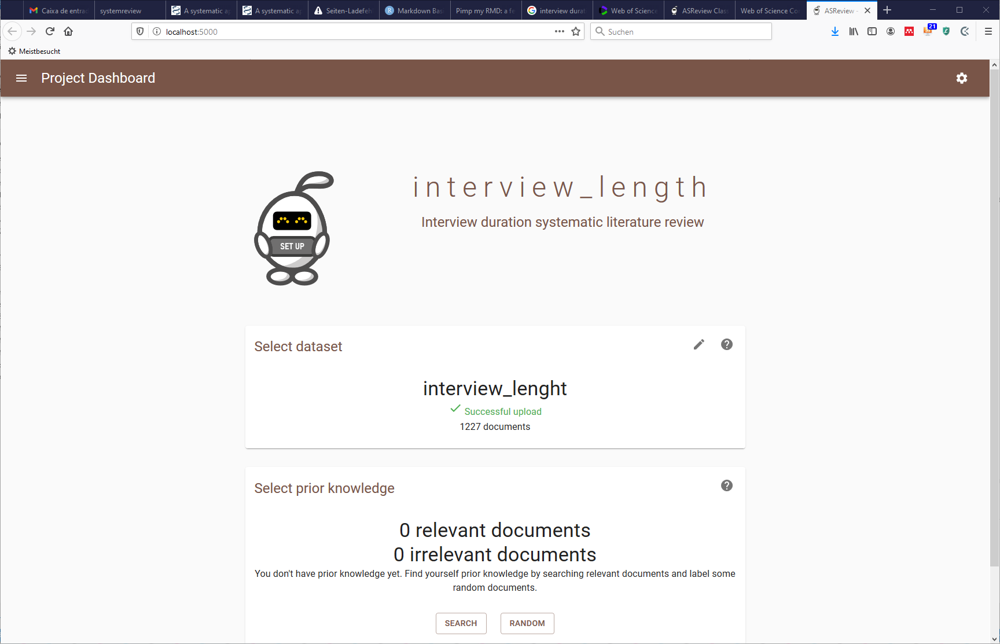
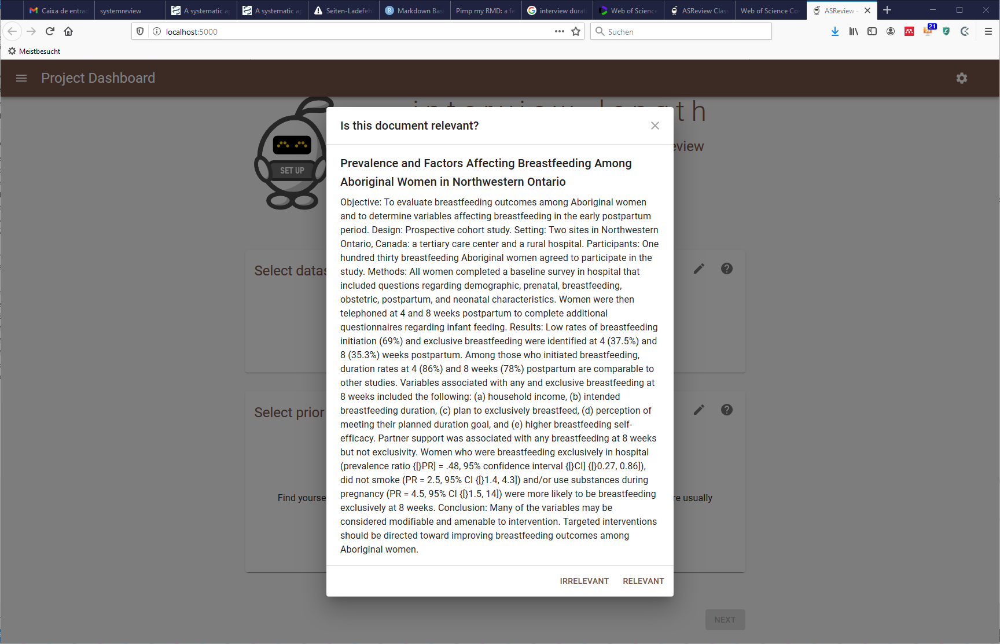

```{r setup, include=FALSE}
knitr::opts_chunk$set(echo = TRUE)
```


# Introduction

The main goal of this presentation is to introduce systematic reviews, why they are useful and present a workflow to conduct a systematic review with 

## What is a systematic review or meta-analysis?

Systematic literature reviews are a method of making sense of large bodies of information, and a means of contributing to the answers to questions about what works and what does not – and many other types of question too. They are a method of mapping out areas of uncertainty, and identifying where little or no relevant research has been done, but where new studies are needed. (Petticew & Roberts, 2005)

Systematic reviews also flag up areas where spurious certainty abounds. These are areas where we think we know more than we do, but where in reality there is little convincing evidence to support our beliefs.

A systematic review answers a defined research question by collecting and summarising all empirical evidence that fits pre-specified eligibility criteria.

A meta-analysis is the use of statistical methods to summarise the results of these studies.

## Why do a systematic review?

The massive expansion of research output, both in peer-reviewed publications, and unpublished, e.g. in conference presentations or symposia, mean it is difficult to establish what work has been done in your area already, and to ensure that knowledge keeps up to date with the best research evidence. 

It will be most useful where:

• there is a clear and defined research question

• several empirical studies have been published

• there is uncertainty about the results

Systematic reviews can be of interventions (i.e. randomised controlled trials) or observations (i.e. case control or cohort studies). The type of study to be included will depend on your research question. Although sociology and psychology have been performing systematic reviews of observational studies for decades, many of the recent resources have been developed within a medical framework using randomised controlled trials (RCTs) to assess whether a treatment is effective or not. In psychology and related disciplines, observational studies are more common (as RCTs may not be feasible or ethical, e.g. it would not be possible to randomise children to poor or enriched social environments to assess impact on cognition), and systematic reviews have a very important role to play.


## Data Sources

There is a very long list of [academic databases and search engines](https://en.wikipedia.org/wiki/List_of_academic_databases_and_search_engines).

How do you choose?

Recent research by Gusenbauer and Haddaway [2019](https://onlinelibrary.wiley.com/doi/full/10.1002/jrsm.1378) 

* [ACM Digital Library](https://dl.acm.org/) 
* [BASE](https://www.base-search.net/) 
* [ClinicalTrials.gov](https://www.clinicaltrials.gov/) 
* [Cochrane Library](https://www.cochranelibrary.com/) 
* [EbscoHost](https://www.ebsco.com/products/research-databases) (tested for ERIC, Medline, EconLit, CINHAL Plus, SportsDiscus)
* [OVID](https://www.ovid.com/) (tested for Embase, Embase Classic, PsychINFO) 
* [ProQuest](https://www.proquest.com/index) (tested for Nursing & Allied Health Database, Public Health Database)
* [PubMed](https://pubmed.ncbi.nlm.nih.gov/) 
* [ScienceDirect](https://www.sciencedirect.com/) 
* [Scopus](https://scopus.com/) 
* [TRID](https://trid.trb.org/) 
* [Virtual Health Library](https://www.who.int/chp/knowledge/vhl/en/) 
* [Web of Science](https://webofknowledge.com/WOS) (tested for Web of Science Core Collection, Medline) 
* [Wiley Online Library](https://onlinelibrary.wiley.com/webof s)


Note: Google scholar, amongst other systems, was found to have severe performance limitations.

**These systems should only be considered supplementary to the principal systems, especially for nonquery‐based search methods where they might still provide great benefit. **


# [Systematic review research strategy](https://www.ncbi.nlm.nih.gov/pmc/articles/PMC6148622/)

* Determine a clear and focused question

* Describe the articles that can answer the question

* Decide which key concepts address the different elements of the question

* Decide which elements should be used for the best results

* Choose an appropriate database and interface to start with

* Document the search process in a text document

* Identify appropriate index terms in the thesaurus of the first database

* Identify synonyms in the thesaurus

* Add variations in search terms

* Use database-appropriate syntax, with parentheses, Boolean operators, and field codes

* Optimize the search

* Evaluate the initial results

* Check for errors

* Translate to other databases

* Test and reiterate


# Running a query 

1. Determine a clear and focused question

*What factors explain better interview duration in computer assisted telephone surveys?*

2. Describe the articles that can answer the question

Research articles that collect and analize interview duration with CATI survey data.

3. What are the research question key concepts?

- Survey

- CATI

- Interview duration

4. Choose the database

We start with the [Web of Science Core Collection](https://www.webofknowledge.com)

5. Document the search process

6. Identify appropriate index terms and identify synonyms

The initial terms we identify are the following:

* duration
* telephone
* Survey

7. Add variations in search terms (truncation, spelling differences, abbreviations, opposites)

* timestamps
* interview lenght
* CATI

8. Use database appropriate syntax

Check the [advance search](http://images.webofknowledge.com/WOKRS535R100/help/WOS/hp_advanced_search.html) help menu of WoS


ALL=(survey  AND  telephone  AND  duration)  

9. Optimize the search


***


***

ALL=(survey OR surveys)  AND  ALL=(telephone  OR  CATI)  AND  ALL=(duration  OR  length  OR  timestamps)




10. Evaluate and check for errors

11. Extend this search to other databases


## So now we got the data and we have 1227 entries. Do we have to read all this papers?

Short answer: yes. 

However, we can look for the help of more systematized methods to reduce the number of papers we actually have to read.

### Presenting the ASReview

[ASReview](https://asreview.nl/) enables you to screen more texts than the traditional way of screening in the same amount of time. Which means that you can achieve a higher quality than when you would have used the traditional approach.

Detailed information regarding how to install and the data format can be found in the website. 


# Compiled everything to a .ris format file and introduce it to ASreview








# Final document


```{r, echo=FALSE}


library(readxl)
library(knitr)


df <- read_excel("asreview_result_interview-length.xlsx")


```


```{r, echo=TRUE}


kable(head(df))


```


## Further information

How to report systematic review and metanalyses?

[PRISMA](https://www.prisma-statement.org/) 


